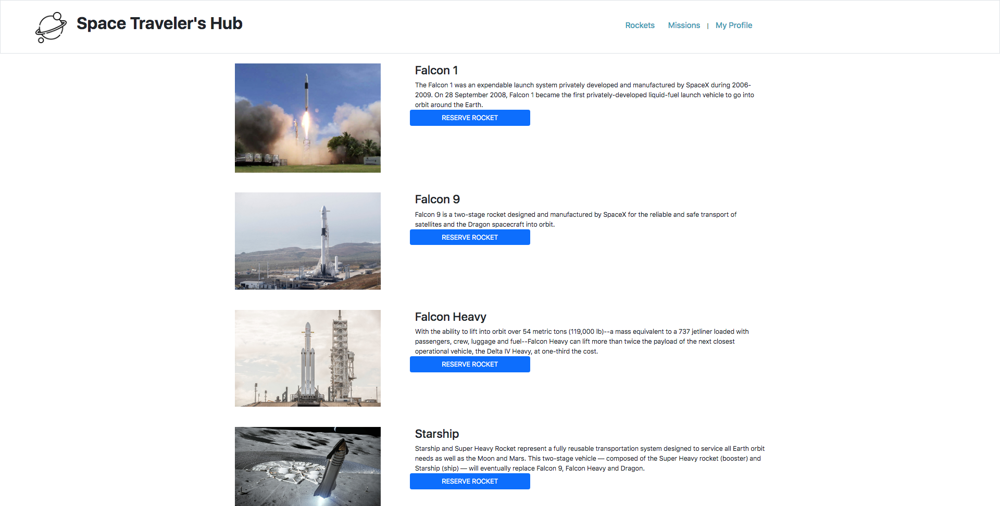

# Spaceships

> A React-Redux spaceship application. Get your favorite SpaceX rockets and missions and add them to your personal list!

Use this app for displaying and saving your favorite rocket ships

## Built With

- JavaScript
- React
- Redux
- Jest

## Getting Started

To get a local copy up and running follow these simple example steps.

### Prerequisites
 A modern web browser (Chrome, Firefox, Safari, Microsoft Edge)

### Usage
 Clone the project by typing in your terminal `git clone https://github.com/mike2611/spaceships.git`.

 Change directory `cd` into the just created from the project.

 Run `npm install`.
 
 Run `npm start`.

 Your computer will open the main page where you can add your name and score
 
## Run tests
 Clone the project using `git clone https://github.com/mike2611/spaceships.git`.

 Run `npx eslint .` for javascript linters.

 Run `npx stylelint "**/*.{css,scss}"` for style linters.

## Authors

👤 **Sunny Díaz**

- GitHub: [@SunnySparks](https://github.com/SunnySparks)
- Twitter: [@JosfranT6](https://twitter.com/JosFranT6)
- Instagram: [@webdev.sunnydiaz](https://www.instagram.com/webdev.sunnydiaz/)
- Portfolio: [sunnydiaz.com](https://sunnydiaz.com/)
- LinkedIn: [LinkedIn](https://www.linkedin.com/in/jose-f-silva/)

👤 **Miguel Angel Puentes**
- GitHub: [@mike2611](https://github.com/mike2611)
- Twitter: [@MiguelP2611](https://twitter.com/MiguelP2611)
- LinkedIn: [Miguel Puentes Mata](https://linkedin.com/in/miguel-puentes-mata-90a562139/)

Contributions, issues, and feature requests are welcome!

Feel free to check the [issues page](https://github.com/mike2611/spaceships.git/issues).

## Show your support

Give a ⭐️ if you like this project!

## Acknowledgments

- JavaScript and React best practices
- API consumption
- Redux-Thunk utilization
- Mock testing for React components

## 📝 License

This project is [MIT](./MIT.md) licensed.
